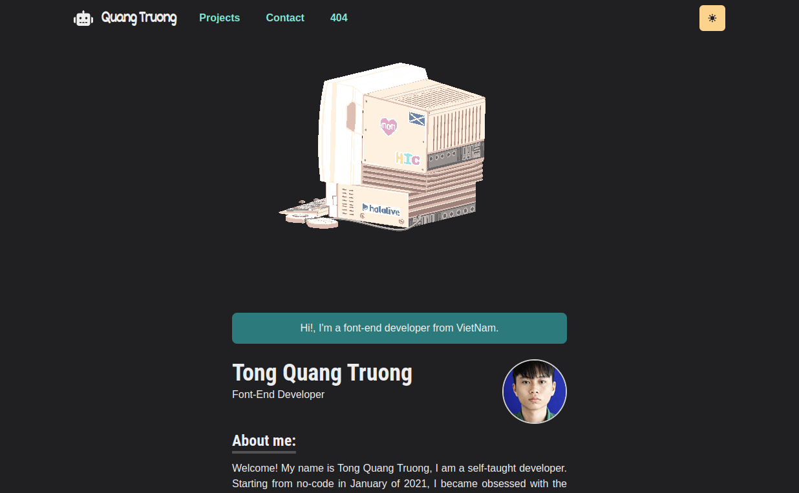
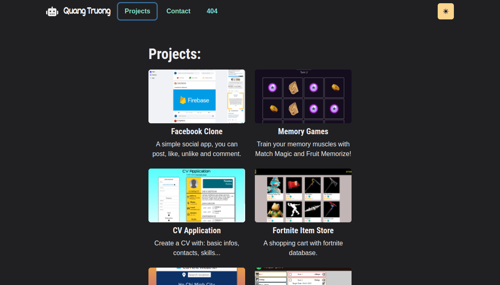
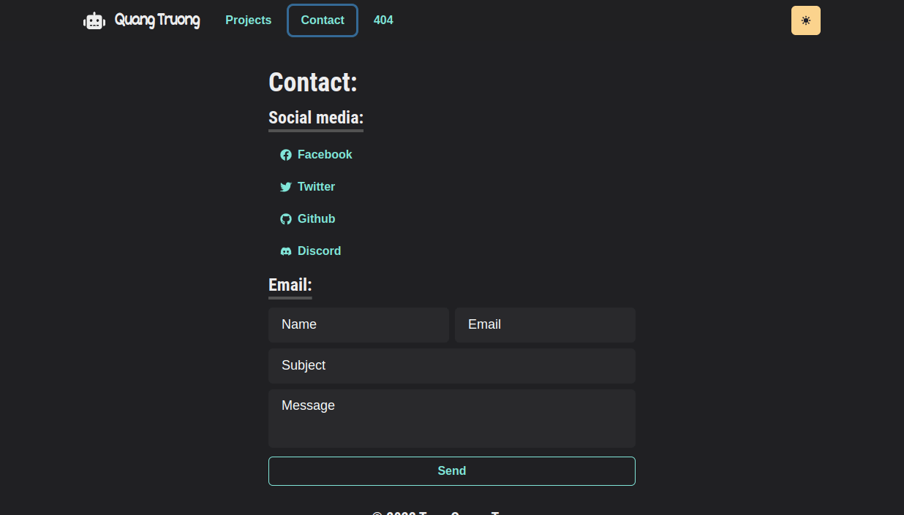
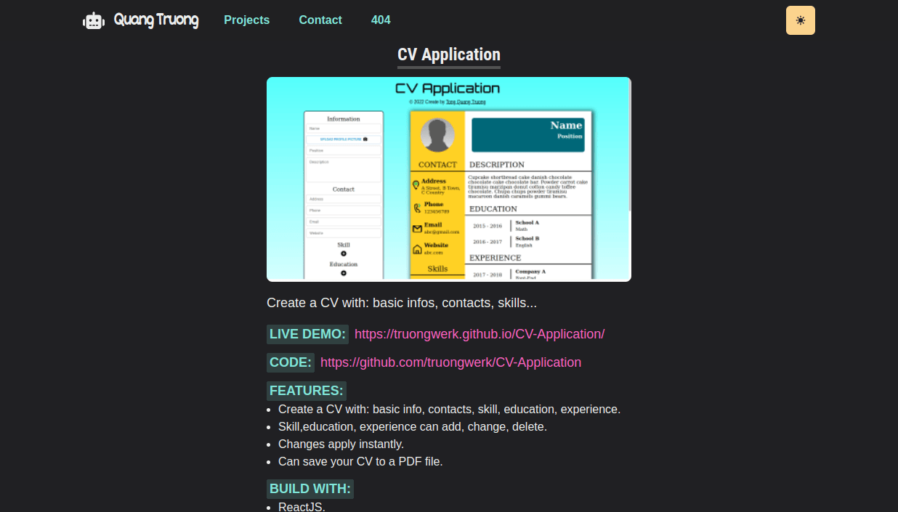

# Portfolio

A site to showcase my work, and contact with me.

## Live https://tongquangtruong.netlify.app/



##



##



##



## Features

- Routing.
- Rotate and play an animate 3d model.
- Page transition.
- Email contact.
- Light/Dark mode.
- Responsive.

## Build With:

- ReactJS.
- React Router.
- THREEjs.
- Framer Motion.
- EmailJS.
- Chakra UI.
- Vite.

## Run Locally

Clone the project

```bash
  git clone git@github.com:truongwerk/Portfolio.git .
```

Install dependencies

```bash
  npm install
```

Start the server

```bash
  npm run dev
```

## License

[MIT](https://choosealicense.com/licenses/mit/)
